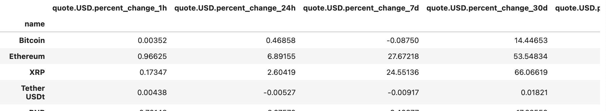

# Automated Crypto Website API Pull

This project automates the process of fetching cryptocurrency market data from the [CoinMarketCap API](https://coinmarketcap.com/api/) at regular intervals, storing it locally, and generating visual analytics for trends and performance. It is designed for crypto analysts, traders, and developers who want near real-time data collection and visualisation.

---

## Features

- Automated API Requests: Pulls cryptocurrency market data up to 333 times/day.
- Data Storage: Saves data in CSV format for long-term analysis.
- Timestamp Logging: Tracks the exact time each data pull occurs.
- Data Aggregation: Groups and averages percentage changes over various time frames (1h, 24h, 7d, 30d, 60d, 90d).
- Visualisation: Creates comparative and trend plots using Seaborn and Matplotlib.
- Example Use Case: Identify top-performing cryptocurrencies over time.

---

## Requirements

Install the required Python packages:
```bash
pip install requests pandas seaborn matplotlib

You also need:

- Python 3.7
- A CoinMarketCap API Key

## How to Run

1. Open the Jupyter Notebook:
   ```bash
   jupyter notebook "Automated Crypto Website API Pull.ipynb"
   ```
2. Run all cells to fetch and visualize data.

## Example Output
The notebook generates plots showing crypto price trends and summary tables of API data.





## License
This project is open-source and available under the MIT License.
